# Japanese Card Templates for Anki

This project is disbanded in favor of a similar project for now.

## Usage and Limitations

1. The decks do not contain cards (except from the 2 demo ones), they are intended as templates for your own vocabulary.

2. I could not fix that the front of the first card is buggy. Therefore just skip to the back, it shows the normal front and a "Show back" button, which shows the normal back. This only works for the first review session between app restarts.

3. Follow the following conventions for data entry in order to benefit from potential future development:

The *dictionary_form* field should contain the primary way to write a word in Japanese, i. e. kanji and kana are possible, and should always be present.

The *dictionary_form_kana* field should contain the pronunciation of the word in Japanese. You can put any text here. This field is optional. I personally use kana and only, if *dictionary_form* contains kanji.

The *translation* field should contain the word in your native language (or any other language, which you want to use) and should always be present.

The *type* field is used to show the type of a word when it is important. Currently only verb types are implemented. For compatibility with future versions, it should be one of *ichidan-verb*, *godan-verb*, *irregular-verb*, *noun*, *i-adjective*, *na-adjective*, *no-adjective*, *name*, *adverb*, or *other* and should always be present.

4. Card styling is optimized for mobile layouts for now. If you use the desktop version, please resize the window to fit your needs. Most sizes are calculated from the horizontal width of the window.

5. Writing cards do not work as intended in AnkiWeb for now. There is an offset between your input and where my code thinks your input is.

6. AnkiDroid support was not tested as I do not own an Android device.

## Decks

### [Luis' Japanese Writing right-handed](https://ankiweb.net/shared/info/1074138091)

Includes native to Japanese writing cards and Japanese to native recall cards.
The style is optimized for right-handed persons, i. e. the scroll area is on the left.

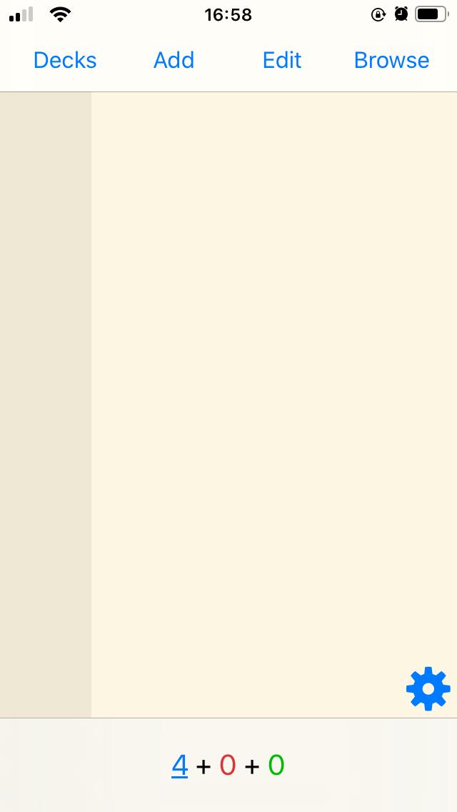</img>
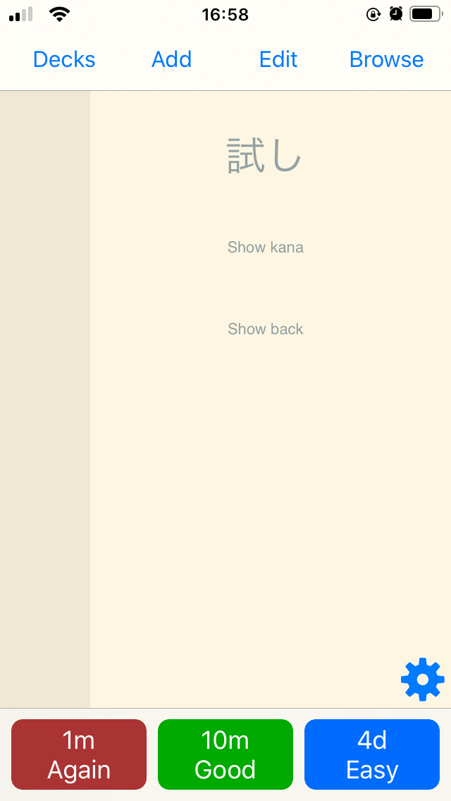</img>
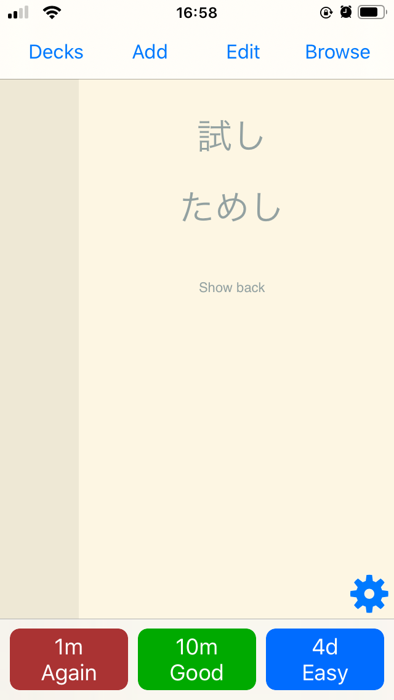</img>
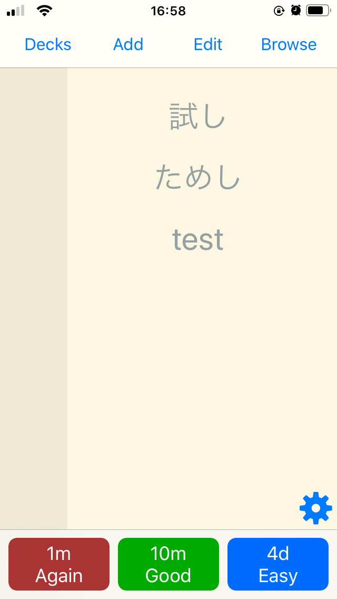</img>
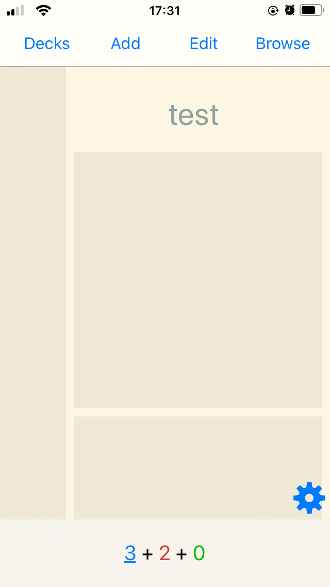</img>
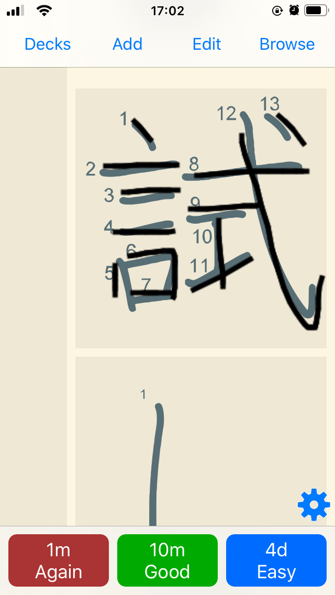</img>
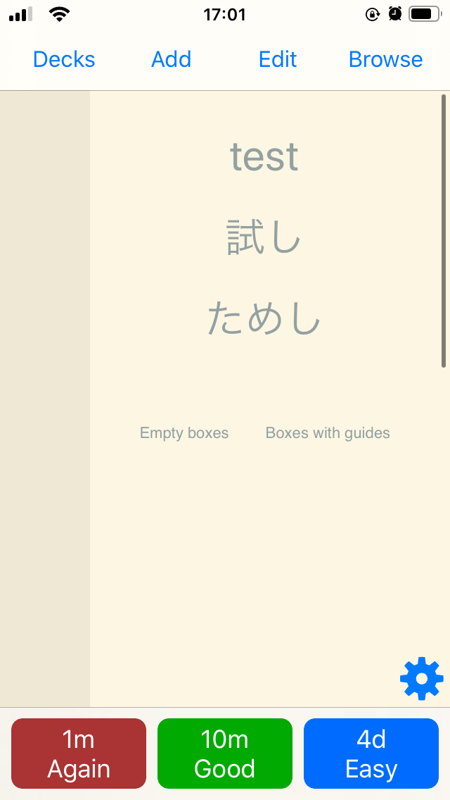</img>
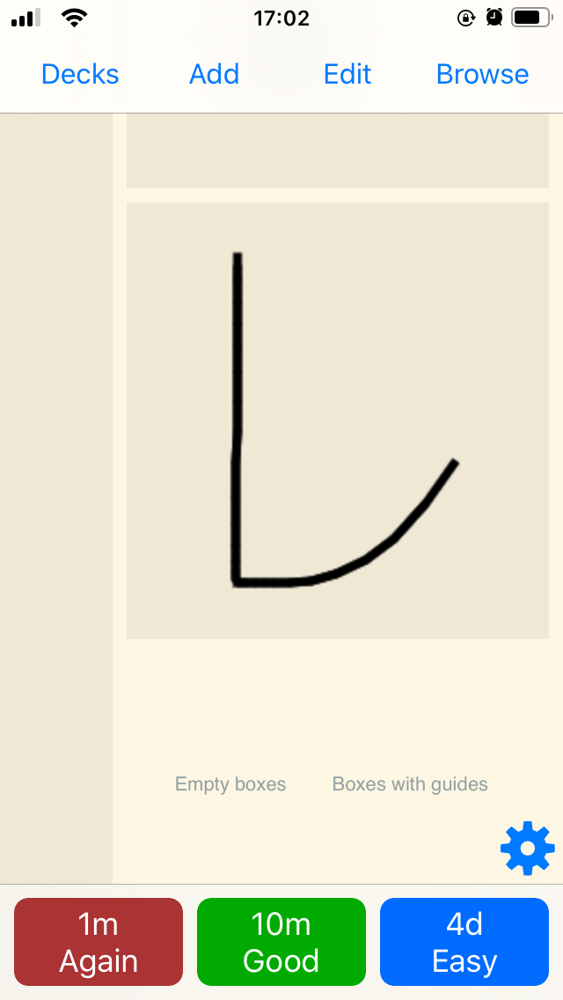</img>
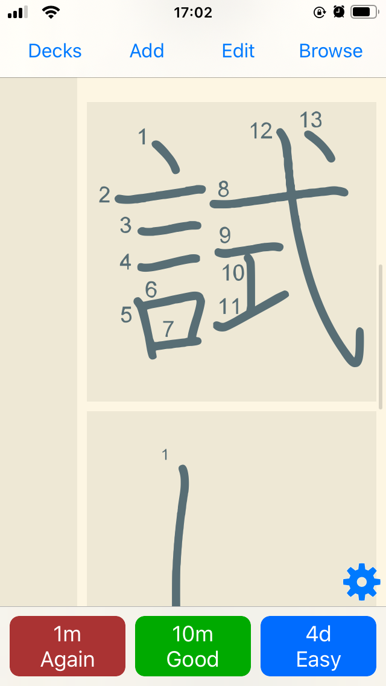</img>

### [Luis' Japanese Writing left-handed](https://ankiweb.net/shared/info/1934329661)

Includes native to Japanese writing cards and Japanese to native recall cards.
The style is optimized for left-handed persons, i. e. the scroll area is on the right.

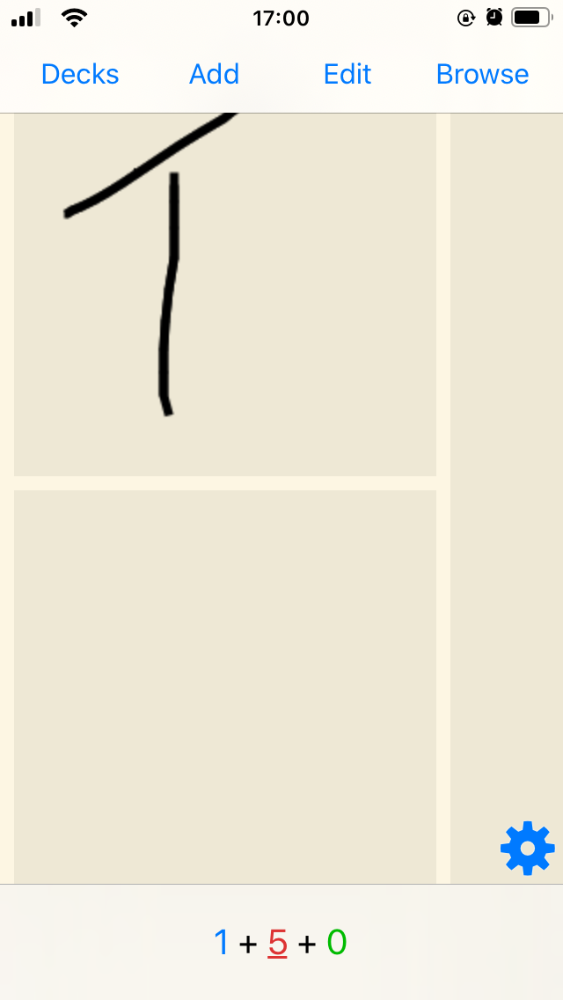</img>

### [Luis' Japanese Writing symmetrical](https://ankiweb.net/shared/info/1569721815)

Includes native to Japanese writing cards and Japanese to native recall cards.
It features a symmetrical layout, i. e. there are two half as wide scroll areas on the left and the right.

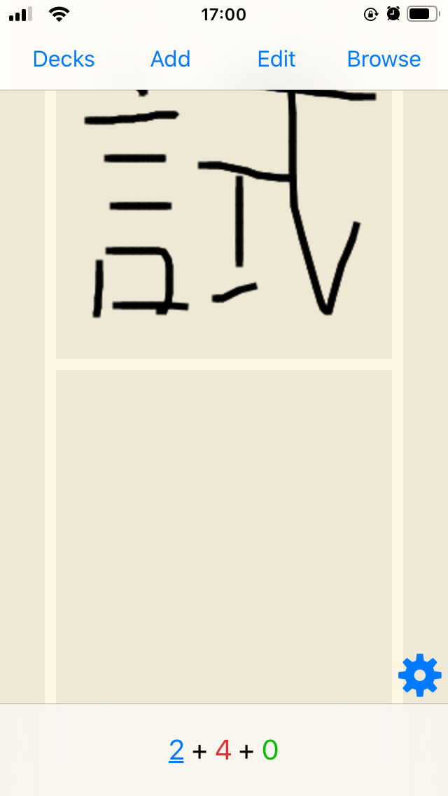</img>

### [Luis' Japanese Recall](https://ankiweb.net/shared/info/1769805441)

Includes native to Japanese and Japanese to native recall cards.
It features a symmetrical layout, i. e. there are two half as wide scroll areas on the left and the right. (Dedicated scroll areas are not as important as on the writing decks as you cannot scroll when touching the writing areas, which do not exist here.)

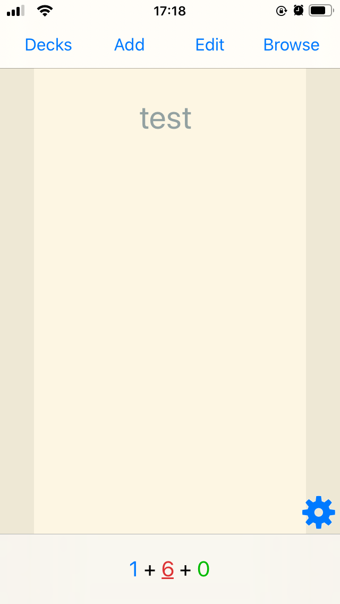</img>
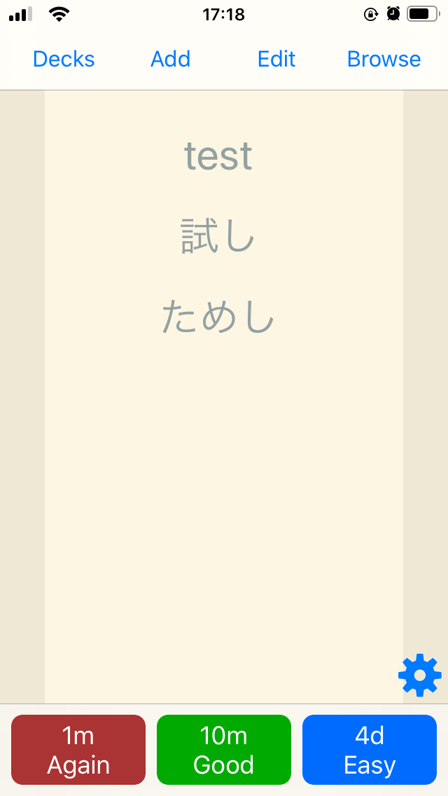</img>

## Installation

1. Add the shared deck of your choice by following the instructions on ankiweb.net like for any other shared deck.
   1. [Luis' Japanese Writing right-handed](https://ankiweb.net/shared/info/1074138091) 
   2. [Luis' Japanese Writing left-handed](https://ankiweb.net/shared/info/1934329661)
   3. [Luis' Japanese Writing symmetrical](https://ankiweb.net/shared/info/1569721815)
   4. [Luis' Japanese Recall](https://ankiweb.net/shared/info/1769805441)
2. (optional) Download a stroke order font, I recommend [this one](https://www.nihilist.org.uk/).
3. (optional) Rename the font file to *_KanjiStrokeOrders.ttf*.
4. (optional) Add the font file in Anki. See [Installing Fonts](https://docs.ankiweb.net/#/templates/styling?id=installing-fonts) in the Anki Manual for detailed instructions.

## Development

It's a webpack project compiling multiple top level components to HTML and CSS for Anki.

Run ```npm run dev``` for development in the browser.

Install [AnkiConnect](https://ankiweb.net/shared/info/2055492159) and run ```npm run build``` for development in the browser and export to Anki.

The decks.json file serves a configuration file for specifying, which components to use as cards and which style files to include on a per deck basis. The build script expects that for each entry in a cards array, there exists two components called like the entry + "Front" or + "Back" respectively. All of the used components must also be specified in sources.json.

### anki-persistence submodule

The anki-persistence submodule is planned to be used in order to use up-to-date code of anki-persistence instead of the copy-pasted code.