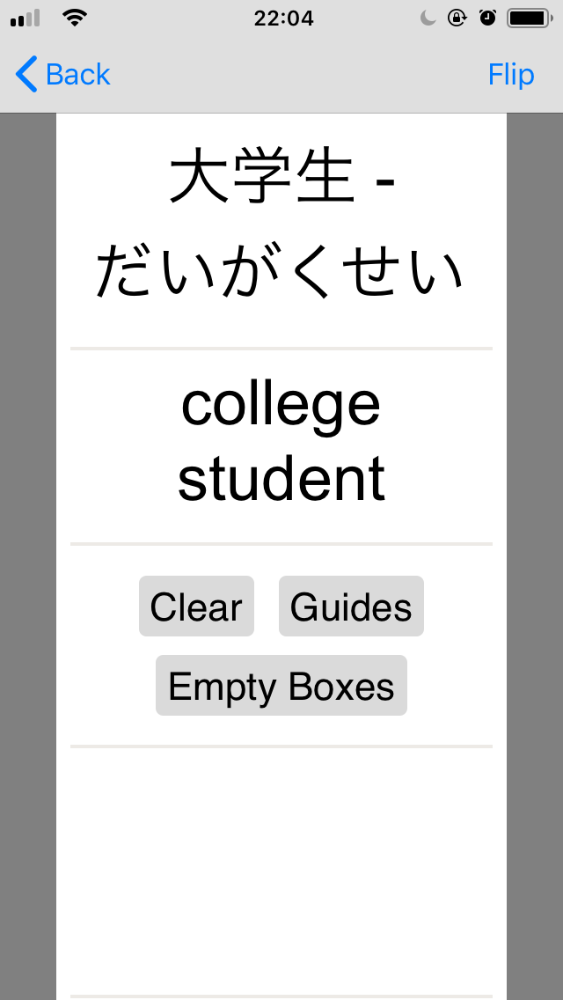
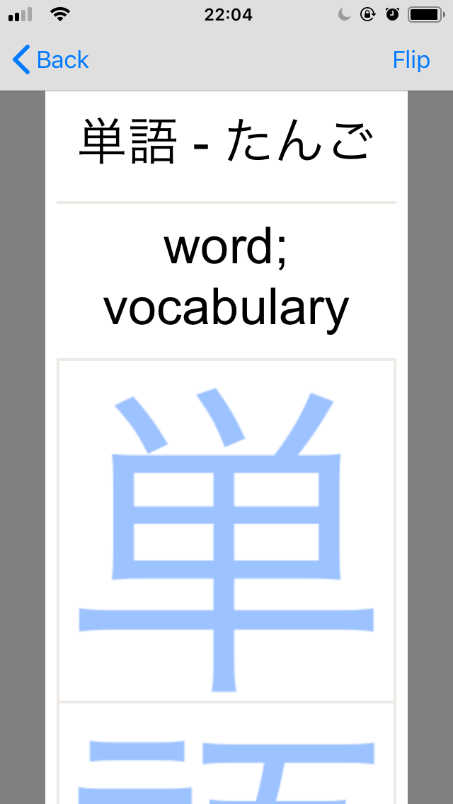
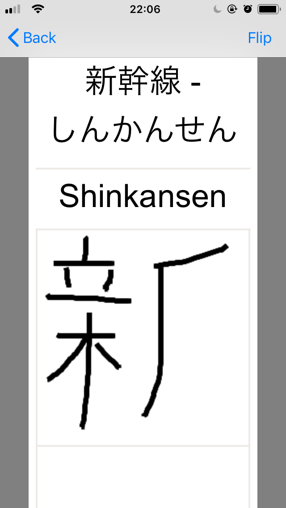
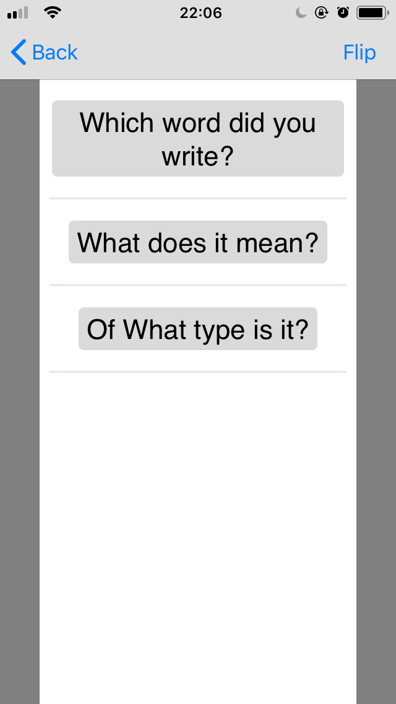
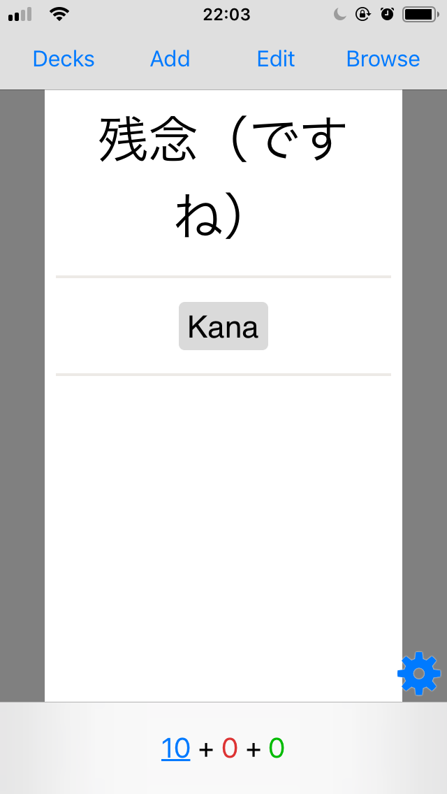
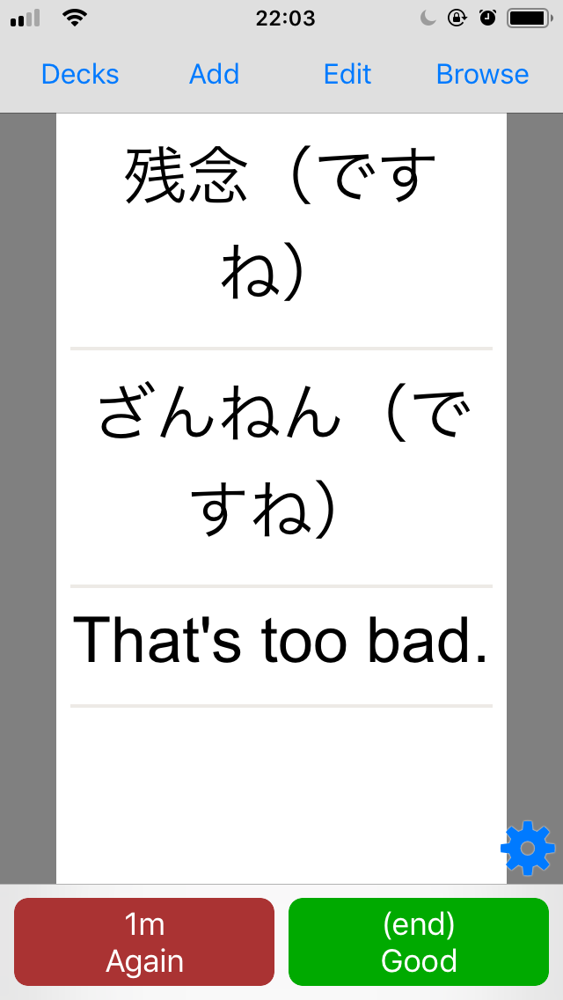
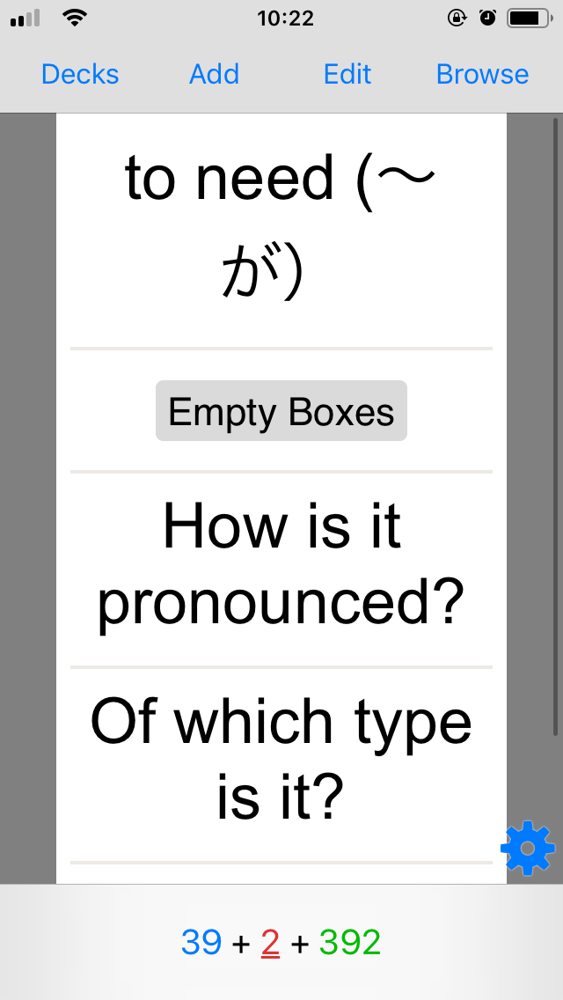
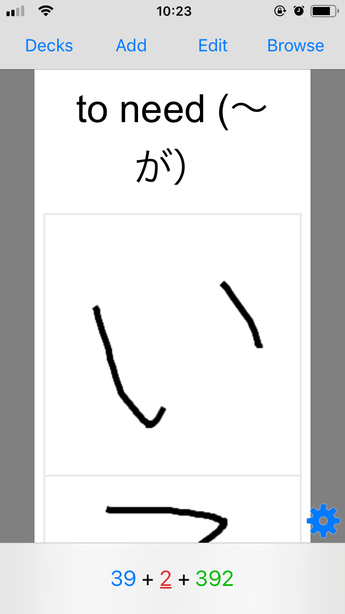
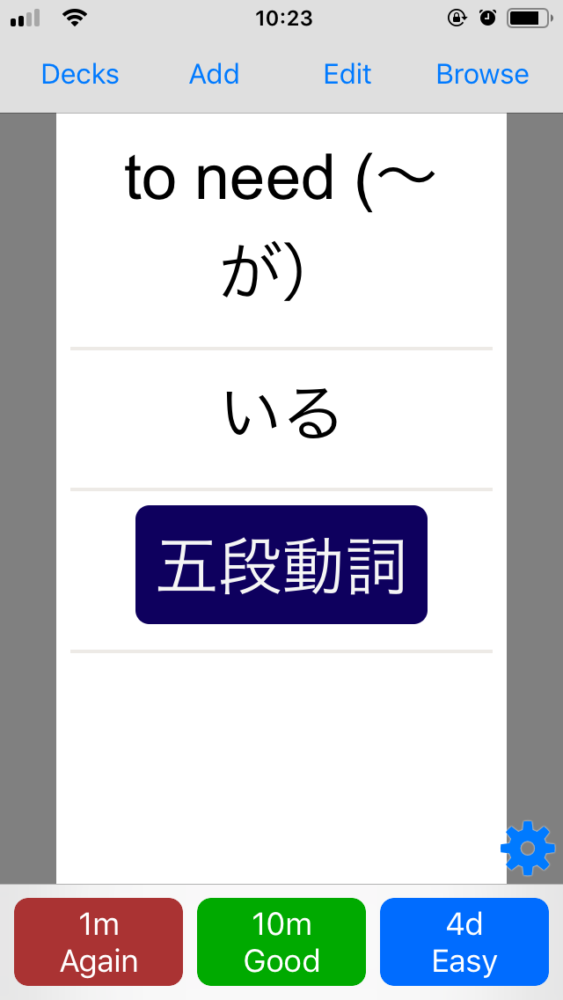

# Japanese Card Templates for Anki

Hi,

these are my in-development card templates for learning Japanese with Anki.

They're far from perfect, but feel free to use and modify them.

The goal of my development on the card templates is not to create flawless designs, but to have cards good enough for myself.

## Preview

### Learn Writing

The learn writing cards show you the "proper" writing (dictionary_form field), the kana writing (dictionary_form_kana field) and the translation (translation field). Then you get the option to either write it with guides in the background or without.

The buttons move velow the boxes after clicking one. So when you have written the word once and are not happy, you can try again. Previously generated boxes will be locked when generating new ones.

</img>
</img>
</img>
</img>

The buttons, e. g. "Which word did you write?", can be clicked to revel the answer in their place.

The type button is only there for verbs and asks for the verb type. Also on the front side, there is an indicator of which verb type the word is, if it is a verb.

### Japanese - Translation

Simple recall cards from Japanese to translations, but with consistent design to the write cards.

</img>
</img>

### Translation - Japanese

Recall cards from translations to Japanese. They provide empty writing fields for the "proper" (dictionary_form) writing.

</img>
</img>
</img>

## Installtion

Currently there's no convenient way to add the templates. Just copy and paste the content of the bodies of the appropirate HTML files and the content of the css file for styling.

## Known limitations

Known limitations might or might not be fixed in the future. :P

Drawing on cards does not work with HiDPI scaling options enabled.

Clear button on write template does not work.

## Fields

### dictionary_form

For the kanji + kana writing

### dictionary_form_kana

For the kana writing. Can be omitted, e. g. if dictionary_form already is kana only.

### translation

The meaning in your preferred language

### type

The type of the word. It is used for displaying additional information. You must use the exact types as me for it to work. The type system might be extended in the future.

Current types in use:

* ichidan-verb
* godan-verb
* irregular-verb

Additional types, which I enter into my notes:

* i-adjective
* na-adjective
* noun
* other